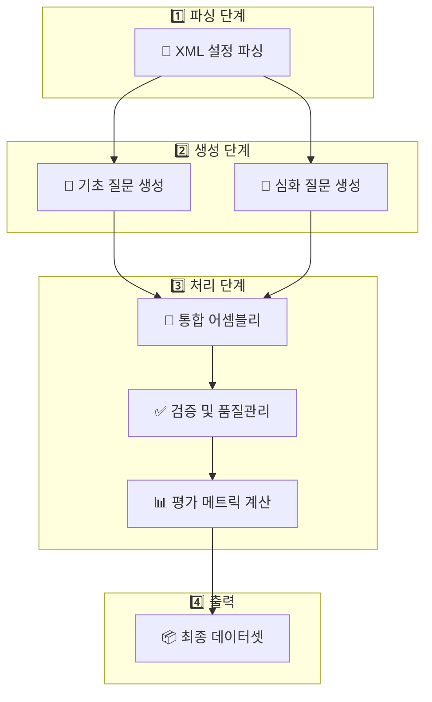

# 🎯 GIA-Re: 네트워크 설정 질문-답변 데이터셋 생성 시스템

**Network Configuration Q&A Dataset Generation with AI-Powered Intelligence**

> 📡 네트워크 설정 분석 및 LLM 성능 평가를 위한 포괄적 데이터셋 생성 시스템

## 🚀 프로젝트 개요

**GIA-Re**는 실제 네트워크 설정 파일(XML)을 분석하여 다양한 복잡도와 관점의 질문-답변 쌍을 자동 생성하는 시스템입니다. 규칙 기반 질문 생성과 LLM 기반 고급 질문 생성을 결합하여, 네트워크 전문가 수준의 평가 데이터셋을 제공합니다.

### 🎯 주요 목표

- **네트워크 LLM 성능 평가**: 실제 운영 환경과 유사한 질문으로 AI 모델 평가
- **다각적 질문 생성**: 6가지 페르소나 x 4가지 복잡도로 다양한 관점 반영
- **정확한 정답 생성**: 실제 네트워크 데이터 분석을 통한 검증된 답변 제공
- **포괄적 평가 지원**: EM, F1, BERT-Score, BLEU, ROUGE 등 다중 메트릭 지원

---

## 🏗️ 시스템 아키텍처

### 📊 6단계 데이터셋 생성 파이프라인



### 🎭 6가지 전문가 페르소나

| 페르소나                      | 역할        | 관심 영역          | 질문 특성           |
| ------------------------- | --------- | -------------- | --------------- |
| 🔧 **Network Engineer**   | 기술적 설정 분석 | BGP, OSPF, 라우팅 | 설정 최적화, 기술적 정확성 |
| 🔐 **Security Auditor**   | 보안 정책 검증  | SSH, AAA, 접근제어 | 취약점 분석, 규정 준수   |
| 📊 **NOC Operator**       | 운영 모니터링   | 장애 대응, 성능      | 실시간 문제 해결       |
| 🏗️ **Network Architect** | 토폴로지 설계   | 확장성, 구조        | 설계 검증, 미래 확장    |
| 🔍 **Troubleshooter**     | 문제 진단     | 장애 원인 분석       | 근본 원인 분석        |
| 📋 **Compliance Officer** | 규정 준수     | 정책 검토, 감사      | 표준 준수, 문서화      |

### 🧠 4단계 복잡도 레벨

| 레벨                | 복잡도    | 설명           | 예시 질문                     |
| ----------------- |:------ | ------------ | ------------------------- |
| 🟢 **Basic**      | 단순 조회  | 팩트 추출, 개수 세기 | "SSH가 설정된 장비는 몇 대인가?"     |
| 🟡 **Analytical** | 분석적 추론 | 패턴 인식, 비교 분석 | "iBGP 풀메시 구성의 완전성을 분석하세요" |
| 🟠 **Synthetic**  | 복합 종합  | 다중 정보 통합     | "네트워크 보안 위험도를 종합 평가하세요"   |
| 🔴 **Diagnostic** | 문제 진단  | 원인 분석, 해결책   | "BGP 피어 불안정의 원인과 해결방안은?"  |

---

## 🏗️ 프로젝트 구조

```text
GIA-Re/
├── 📁 parsers/           # XML 파싱 모듈
│   ├── universal_parser.py          # 통합 XML 파서 (Cisco IOS/IOS-XR)
│   └── vendor/                      # 벤더별 파서 확장
├── 📁 generators/        # 질문 생성 모듈
│   ├── rule_based_generator.py      # 규칙 기반 질문 생성 (기초)
│   ├── enhanced_llm_generator.py    # LLM 기반 고급 질문 생성 (심화)
│   └── llm_explorer.py             # LLM 탐색 엔진 (실험적)
├── 📁 assemblers/        # 테스트 조립 모듈
│   └── test_assembler.py           # 최종 테스트 데이터셋 조립
├── 📁 inspectors/        # 평가 및 검증 모듈
│   ├── evaluation_system.py       # 종합 평가 시스템
│   └── intent_inspector.py        # 의도 분석 모듈
├── 📁 utils/             # 핵심 유틸리티
│   ├── builder_core.py            # 메트릭 계산 엔진 (100+ 메트릭)
│   ├── llm_adapter.py             # LLM 연동 어댑터
│   ├── config_manager.py          # 설정 관리
│   └── simple_generator.py        # 간단 생성기
├── 📁 policies/          # 정책 및 규칙 정의
│   └── policies.json              # 11개 카테고리별 생성 정책
├── 📁 XML_Data/          # 입력 XML 파일 (6대 장비)
│   ├── ce1.xml, ce2.xml          # 고객 장비 설정 (CE)
│   └── sample7-10.xml            # 통신사 장비 설정 (PE)
├── 📁 xml_분석/          # 네트워크 분석 보고서
│   ├── XML_설정_데이터_종합_분석_보고서.md
│   ├── 네트워크_XML_설정_초보자_가이드.md
│   └── XML_설정_빠른참조_치트시트.md
├── 📁 demo_output/       # 생성 결과 및 보고서
│   ├── network_config_qa_dataset.json    # 최종 데이터셋
│   ├── dataset_report.html              # 인터랙티브 HTML 보고서
│   └── train.json, validation.json, test.json
├── answer_agent.py       # 답변 생성 에이전트
├── command_agent.py      # 네트워크 명령어 생성 에이전트
├── integrated_pipeline.py        # 통합 파이프라인 (메인 실행)
└── README.md            # 본 문서
```

---

## 🔧 핵심 에이전트 시스템

### 1. 📡 Answer Agent (`answer_agent.py`)

네트워크 전문가 수준의 정답 생성 및 설명 제공

```python
class AnswerAgent:
    """메트릭 기반 추론을 통한 전문적 답변 생성기"""

    def execute_plan(self, question: str, plan: Union[List[Dict], str]) -> Dict:
        """
        단계별 추론을 통해 정답과 설명 생성
        - 100+ 네트워크 메트릭 활용
        - 다단계 추론 지원  
        - 검증된 증거 기반 답변
        """
```

**🎯 주요 기능:**

- **📊 메트릭 기반 추론**: BGP, OSPF, VRF, SSH 등 100+ 메트릭 활용
- **🧮 다단계 계산**: 복합 메트릭을 조합한 심화 분석
- **📝 설명 생성**: LLM을 활용한 전문적 해설 제공
- **🔍 증거 추적**: 답변 근거가 되는 설정 파일 및 수치 제시

**💡 실행 예시:**

```python
from answer_agent import AnswerAgent

agent = AnswerAgent(network_facts)
plan = [
    {"step": 1, "required_metric": "ssh_missing_count"},
    {"step": 2, "required_metric": "ssh_enabled_devices"}
]

result = agent.execute_plan("SSH 설정 상태는?", plan)
print(result)
# {
#   "ground_truth": "SSH가 설정되지 않은 장비는 2대입니다.",
#   "explanation": "전체 6대 장비 중 sample8과 sample10에서 SSH 설정이 누락...",
#   "source_files": ["sample8.xml", "sample10.xml"]
# }
```

### 2. 💻 Command Agent (`command_agent.py`)

네트워크 장비별 맞춤 명령어 생성

```python
class CommandAgent:
    """벤더별 네트워크 명령어 생성 시스템"""

    def generate(self, metric_name: str, params: Dict) -> str:
        """
        장비 유형에 맞는 CLI 명령어 생성
        - Cisco IOS/IOS-XR 지원
        - 파라미터 기반 동적 생성
        - 실무 시나리오 반영
        """
```

**🛠️ 지원 명령어 유형:**

| 카테고리      | 명령어 예시                                        | 용도      |
| --------- | --------------------------------------------- | ------- |
| 🔍 **진단** | `show bgp summary`, `show ip interface brief` | 상태 확인   |
| ⚙️ **설정** | `router bgp`, `interface description`         | 구성 변경   |
| 🔐 **보안** | `ssh`, `access-class`, `aaa`                  | 보안 설정   |
| 🌐 **고급** | `ssh proxy jump`, `vrf forwarding`            | 복합 시나리오 |

---

## 📊 메트릭 시스템 (`utils/builder_core.py`)

### 🔢 100+ 네트워크 메트릭 지원

#### 🔐 보안 메트릭

| 메트릭명                  | 설명             | 반환값 예시                   |
| --------------------- | -------------- | ------------------------ |
| `ssh_enabled_devices` | SSH 활성화된 장비 목록 | `["sample7", "sample9"]` |
| `ssh_missing_count`   | SSH 미설정 장비 수   | `2`                      |
| `aaa_enabled_devices` | AAA 활성화된 장비 목록 | `["ce1", "ce2"]`         |

#### 🌐 BGP 메트릭

| 메트릭명                      | 설명               | 반환값 예시                                    |
| ------------------------- | ---------------- | ----------------------------------------- |
| `ibgp_missing_pairs`      | iBGP 풀메시 누락 피어 쌍 | `["sample8-sample9", "sample8-sample10"]` |
| `ibgp_under_peered_count` | iBGP 피어 부족 장비 수  | `1`                                       |
| `neighbor_list_ibgp`      | iBGP 이웃 목록       | `{"sample7": ["1.1.1.1", "2.2.2.2"]}`     |

#### 🔀 VRF 메트릭

| 메트릭명                   | 설명           | 반환값 예시                         |
| ---------------------- | ------------ | ------------------------------ |
| `vrf_without_rt_count` | RT 미설정 VRF 수 | `1`                            |
| `vrf_rd_map`           | VRF RD 매핑    | `{"CUSTOMER_A": "65000:100"}`  |
| `vrf_names_set`        | VRF 이름 목록    | `["CUSTOMER_A", "CUSTOMER_B"]` |

#### 🔗 L2VPN 메트릭

| 메트릭명                 | 설명             | 반환값 예시       |
| -------------------- | -------------- | ------------ |
| `l2vpn_unidir_count` | 단방향 L2VPN 수    | `0`          |
| `l2vpn_pw_id_set`    | L2VPN PW-ID 목록 | `[100, 200]` |

#### 📡 OSPF 메트릭

| 메트릭명                   | 설명                  | 반환값 예시     |
| ---------------------- | ------------------- | ---------- |
| `ospf_area0_if_count`  | OSPF Area 0 인터페이스 수 | `4`        |
| `ospf_process_ids_set` | OSPF 프로세스 ID 목록     | `[1, 100]` |

---

## 🎯 질문 생성 시스템

### 📋 Rule-Based Generator (`generators/rule_based_generator.py`)

정책 기반 체계적 질문 생성

**🗂️ 지원 카테고리 (11개):**

| 카테고리                       | 설명                   | 대표 메트릭                 | 질문 예시                    |
| -------------------------- | -------------------- | ---------------------- | ------------------------ |
| 🔐 **Security_Policy**     | SSH, AAA 보안 설정 검증    | `ssh_missing_count`    | "SSH가 설정되지 않은 장비는?"      |
| 🌐 **BGP_Consistency**     | iBGP 풀메시, 피어링 일관성    | `ibgp_missing_pairs`   | "iBGP 풀메시에서 누락된 피어는?"    |
| 🔀 **VRF_Consistency**     | VRF RD/RT 설정, 라우팅 격리 | `vrf_without_rt_count` | "RT가 설정되지 않은 VRF는?"      |
| 🔗 **L2VPN_Consistency**   | L2VPN 연결성, PW-ID 매칭  | `l2vpn_unidir_count`   | "단방향 L2VPN 연결은?"         |
| 🗺️ **OSPF_Consistency**   | OSPF 영역, 이웃 관계       | `ospf_area0_if_count`  | "OSPF Area 0의 인터페이스 수는?" |
| 📊 **System_Inventory**    | 장비 정보, 버전, 사용자       | `system_hostname_text` | "각 장비의 호스트네임은?"          |
| 🔍 **Security_Inventory**  | 보안 설정 현황             | `ssh_present_bool`     | "SSH 설정이 존재하는가?"         |
| 🔌 **Interface_Inventory** | 인터페이스 상태, IP 할당      | `interface_count`      | "총 인터페이스 수는?"            |
| 📡 **Routing_Inventory**   | 라우팅 프로토콜 현황          | `bgp_neighbor_count`   | "BGP 이웃의 총 수는?"          |
| ⚡ **Services_Inventory**   | L3VPN, MPLS 서비스      | `vrf_count`            | "설정된 VRF의 수는?"           |
| 💻 **Command_Generation**  | CLI 명령어 생성           | 명령어 템플릿                | "BGP 이웃 추가 명령어는?"        |

### 🤖 Enhanced LLM Generator (`generators/enhanced_llm_generator.py`)

AI 기반 복합 추론 질문 생성

**🎨 특화 템플릿 예시:**

```python
QuestionTemplate(
    complexity=QuestionComplexity.ANALYTICAL,
    persona=PersonaType.NETWORK_ENGINEER,
    scenario="BGP 경로 수렴 분석",
    prompt_template="""
    네트워크 엔지니어 관점에서, 주어진 BGP 설정을 분석하여:

    1. 🔄 경로 수렴성 분석: iBGP 풀메시 누락이 경로 수렴에 미치는 영향
    2. ⚠️ 장애 영향도 평가: 특정 피어 장애시 전체 네트워크 파급효과  
    3. ✅ 설정 일관성 검증: AS 내 라우터들의 BGP 설정 일관성

    각 질문은 분석적 추론이 필요하고 여러 메트릭을 종합한 판단을 요구합니다.
    """,
    expected_metrics=["ibgp_missing_pairs", "neighbor_list_ibgp", "bgp_neighbor_count"]
)
```

---

## 🎨 평가 시스템 (`inspectors/evaluation_system.py`)

### 📏 다중 평가 메트릭

#### 📊 공통 메트릭

| 메트릭                  | 설명          | 적용 대상 |
| -------------------- | ----------- | ----- |
| **Exact Match (EM)** | 정확한 일치율     | 모든 답변 |
| **F1 Score**         | 토큰 레벨 F1 점수 | 모든 답변 |
| **Token Accuracy**   | 토큰 정확도      | 단답형   |

#### 📝 장문 답변 메트릭

| 메트릭            | 설명           | 특징                    |
| -------------- | ------------ | --------------------- |
| **BERT-Score** | 의미적 유사도      | F1, Precision, Recall |
| **BLEU**       | n-gram 기반 품질 | 번역 품질 평가              |
| **ROUGE-L**    | 최장 공통 부분수열   | 요약 품질 평가              |

#### 🔍 네트워크 도메인 특화 정규화

| 정규화 유형      | 변환 예시                            | 목적         |
| ----------- | -------------------------------- | ---------- |
| **IP 주소**   | `192.168.1.1/24` → `192.168.1.1` | 서브넷 마스크 제거 |
| **AS 번호**   | `AS 65000` → `as65000`           | 표기법 통일     |
| **인터페이스**   | `GigabitEthernet0/0` → `ge0/0`   | 축약형 변환     |
| **Boolean** | `활성` → `true`, `비활성` → `false`   | 언어 중립화     |

---

## 💾 데이터셋 구조

### 📋 샘플 데이터 형식

```json
{
  "id": "ENHANCED_ENH_001",
  "question": "현재 네트워크에서 iBGP 풀메시 구성이 완전한지 분석하고, 누락된 피어링이 있다면 그 영향도를 평가하세요.",
  "context": "BGP 설정 현황:\nsample7: AS65000, 3개 피어\nsample8: AS65000, 2개 피어\nsample9: AS65000, 2개 피어\nsample10: AS65000, 2개 피어",
  "ground_truth": "iBGP 풀메시가 불완전합니다. 총 4대의 라우터가 AS65000에 속해있지만, 필요한 6개의 피어 연결 중 4개만 설정되어 있습니다. 누락된 연결은 sample8-sample9, sample8-sample10입니다.",
  "explanation": "iBGP 풀메시 분석 결과, sample7을 중심으로 한 허브 구조로 되어있어 sample8, sample9, sample10 간의 직접 피어링이 부족합니다. 이는 sample7 장애시 네트워크 분할을 야기할 수 있습니다.",
  "answer_type": "long",
  "category": "Enhanced_Analysis",
  "complexity": "analytical",
  "level": 3,
  "persona": "network_engineer",
  "source_files": ["sample7.xml", "sample8.xml", "sample9.xml", "sample10.xml"],
  "metadata": {
    "origin": "enhanced_llm_with_agent",
    "task_category": "네트워크 토폴로지 구성 질의",
    "overall_score": 0.89,
    "reasoning_plan": [
      {"step": 1, "action": "iBGP 피어 관계 분석"},
      {"step": 2, "action": "풀메시 완전성 검증"},
      {"step": 3, "action": "장애 영향도 평가"}
    ]
  }
}
```

### 📂 출력 파일 구조

```text
demo_output/
├── 📊 network_config_qa_dataset.json    # 전체 데이터셋
├── 🚂 train.json                        # 훈련용 (70%)
├── ✅ validation.json                   # 검증용 (15%)  
├── 🧪 test.json                         # 테스트용 (15%)
├── 📋 metadata.json                     # 생성 메타데이터
├── 🎨 dataset_report.html               # 인터랙티브 HTML 리포트
├── 📈 dataset_for_evaluation.csv        # 평가용 CSV
└── 🔧 assembled_[complexity].json       # 복잡도별 중간 결과
```

---

## 🛠️ 실행 방법

### 📦 설치 및 설정

#### 1. **환경 준비**

```bash
# 저장소 클론
git clone https://github.com/your-repo/GIA-Re.git
cd GIA-Re

# 가상환경 생성 (권장)
python -m venv venv
source venv/bin/activate  # Linux/Mac
# venv\Scripts\activate   # Windows

# 의존성 설치
pip install -r requirements.txt
```

#### 2. **환경 변수 설정** (`.env` 파일 생성)

```env
# OpenAI API (권장)
OPENAI_API_KEY=your_openai_api_key_here

# Anthropic API (선택사항)
ANTHROPIC_API_KEY=your_anthropic_api_key_here
```

#### 3. **설정 파일 확인** (`config/settings.yaml`)

```yaml
models:
  main: "gpt-4o"                 # 메인 생성 모델
  answer_synthesis: "gpt-4o"     # 답변 합성 모델

generation:
  basic_questions_per_category: 10
  enhanced_questions_per_category: 15

llm:
  temperature: 0.1
  max_tokens: 1000
```

### 🚀 실행 옵션

#### 기본 실행 (전체 파이프라인)

```bash
# 모든 카테고리로 전체 파이프라인 실행
python integrated_pipeline.py
```

#### 빠른 데모 실행

```bash
# 축소 버전으로 빠른 테스트
python demo_implementation.py
```

#### 맞춤 설정 실행

```python
from integrated_pipeline import NetworkConfigDatasetGenerator, PipelineConfig
from generators.enhanced_llm_generator import QuestionComplexity, PersonaType

# 맞춤 설정
config = PipelineConfig(
    xml_data_dir="data/raw/XML_Data",
    policies_path="policies.json",
    target_categories=["Security_Policy", "BGP_Consistency"],
    basic_questions_per_category=5,
    enhanced_questions_per_category=3,
    target_complexities=[QuestionComplexity.ANALYTICAL],
    target_personas=[PersonaType.NETWORK_ENGINEER, PersonaType.SECURITY_AUDITOR],
    output_dir="custom_output"
)

# 생성 실행
generator = NetworkConfigDatasetGenerator(config)
dataset = generator.generate_complete_dataset()

print(f"✅ 생성 완료: {dataset['metadata']['total_samples']}개 질문")
```

---

## 📋 네트워크 환경 분석

### 🖥️ 테스트 장비 구성 (6대)

| 장비명          | 역할                  | 플랫폼          | 관리 IP        | BGP AS | 주요 기능   | 상태   |
| ------------ | ------------------- | ------------ | ------------ | ------ | ------- | ---- |
| **CE1**      | Customer Edge       | Cisco IOS    | 172.16.1.40  | 65001  | 고객 A 연결 | ✅ 운영 |
| **CE2**      | Customer Edge       | Cisco IOS    | 172.16.1.41  | 65002  | 고객 B 연결 | ✅ 운영 |
| **sample7**  | Provider Edge (Hub) | Cisco IOS-XR | 172.16.1.130 | 65000  | 중앙 허브   | ✅ 운영 |
| **sample8**  | Provider Edge       | Cisco IOS-XR | 172.16.1.131 | 65000  | 동쪽 엣지   | ✅ 운영 |
| **sample9**  | Provider Edge       | Cisco IOS-XR | 172.16.1.132 | 65000  | 서쪽 엣지   | ✅ 운영 |
| **sample10** | Provider Edge       | Cisco IOS-XR | 172.16.1.133 | 65000  | 남쪽 엣지   | ✅ 운영 |

### 🌐 네트워크 토폴로지

```text
                 Provider Network (AS 65000)
    ┌─────────────────────────────────────────────────┐
    │                                                 │
    │    [CE1] ────── [sample7] ────── [sample8]      │
    │   (65001)         │ (Hub)           │           │
    │                   │                 │           │  
    │    [CE2] ────── [sample10] ──── [sample9]       │
    │   (65002)                                       │
    │                                                 │
    └─────────────────────────────────────────────────┘

    🔗 연결 정보:
    • iBGP 풀메시: AS65000 내부 (4대 PE 라우터)
    • eBGP: CE ↔ PE 연결 (고객 AS ↔ 통신사 AS)
    • L2VPN: sample7 ↔ sample9 (PW-ID: 100)
    • Physical Links: 6개 (이중화 구조)
```

### 🔧 주요 서비스 구성

| 서비스          | 설명                              | 구성 장비            | 상태            |
| ------------ | ------------------------------- | ---------------- | ------------- |
| 🌐 **BGP**   | AS65000 내 iBGP 풀메시 + eBGP 고객 연결 | 전체 6대            | 부분적 (풀메시 불완전) |
| 🔗 **L2VPN** | Pseudowire 기반 Layer 2 연결        | sample7, sample9 | 정상            |
| 📡 **OSPF**  | Provider 네트워크 내부 라우팅            | PE 4대            | 정상            |
| 🔀 **VRF**   | L3VPN 서비스를 위한 가상 라우팅            | PE 4대            | 일부 RT 누락      |
| 🔐 **보안**    | SSH, AAA 인증 설정                  | 전체 6대            | 일부 장비 누락      |

---

## 📊 생성 결과 예시

### 🎯 실제 생성 통계 (demo_output 기준)

#### 질문 유형별 분포

| 복잡도               | 개수  | 설명           |
| ----------------- | --- | ------------ |
| 🟢 **Basic**      | 343 | 단순 조회, 개수 세기 |
| 🟡 **Analytical** | 45  | 분석적 추론, 비교   |
| 🟠 **Synthetic**  | 43  | 복합 정보 종합     |
| 🔴 **Diagnostic** | 16  | 문제 진단, 해결책   |


### 🎨 질문 예시 샘플

#### 🟢 Basic Level 질문

```json
{
  "question": "SSH가 설정되지 않은 장비는 몇 대인가요?",
  "ground_truth": "2",
  "explanation": "전체 6대 장비 중 sample8과 sample10에서 SSH 설정이 누락되었습니다.",
  "category": "Security_Policy",
  "complexity": "basic",
  "answer_type": "short"
}
```

#### 🟡 Analytical Level 질문

```json
{
  "question": "iBGP 풀메시 구성이 완전한지 분석하고, 누락된 연결이 있다면 나열하세요.",
  "ground_truth": "불완전합니다. 누락된 연결: sample8-sample9, sample8-sample10",
  "explanation": "AS65000 내 4대 라우터에서 풀메시를 위해서는 6개 연결이 필요하지만 현재 4개만 설정되어 있습니다. sample7을 중심으로 한 허브 구조로 되어있어 sample8과 다른 PE 간 직접 피어링이 부족합니다.",
  "category": "BGP_Consistency",
  "complexity": "analytical",
  "answer_type": "long"
}
```

#### 🔴 Diagnostic Level 질문

```json
{
  "question": "현재 네트워크에서 가장 위험한 단일 장애점(SPOF)을 식별하고 그 영향도를 평가하세요.",
  "ground_truth": "sample7이 가장 위험한 SPOF입니다.",
  "explanation": "sample7은 허브 역할을 하며 CE1 연결, L2VPN 종단점, 다른 PE들과의 주요 연결점입니다. 이 장비가 장애나면 CE1 서비스 중단, L2VPN 연결 끊김, iBGP 경로 수렴 문제가 발생합니다.",
  "category": "Enhanced_Analysis",
  "complexity": "diagnostic",
  "answer_type": "long"
}
```

---

## 

## 🧪 확장 및 개발

### 🔌 새로운 메트릭 추가

#### 1. 메트릭 구현

```python
# utils/builder_core.py에 추가
def calculate_custom_security_score(self, params: Dict = None) -> Tuple[float, List[str]]:
    """커스텀 보안 점수 메트릭"""
    security_factors = {
        'ssh_enabled': 0.3,
        'aaa_enabled': 0.3, 
        'acl_configured': 0.2,
        'password_policy': 0.2
    }

    score = 0.0
    source_files = []

    for device in self.devices:
        # 보안 요소별 점수 계산
        device_score = self._calculate_device_security(device, security_factors)
        score += device_score
        source_files.append(device.get('file'))

    return score / len(self.devices), source_files
```

#### 2. 정책 파일 업데이트

```json
{
  "category": "Custom_Security_Analysis",
  "levels": {
    "1": [{
      "goal": "security_assessment",
      "targets": ["GLOBAL"],
      "primary_metric": "custom_security_score"
    }]
  }
}
```

### 🎭 새로운 페르소나 추가

#### 1. 페르소나 정의

```python
# generators/enhanced_llm_generator.py
class PersonaType(Enum):
    CLOUD_ARCHITECT = "cloud_architect"
    DEVOPS_ENGINEER = "devops_engineer"
    NETWORK_AUTOMATION_ENGINEER = "automation_engineer"
```

#### 2. 전용 질문 템플릿

```python
QuestionTemplate(
    complexity=QuestionComplexity.SYNTHETIC,
    persona=PersonaType.CLOUD_ARCHITECT,
    scenario="클라우드 네트워크 설계",
    prompt_template="""
    클라우드 아키텍트 관점에서 다음을 분석하세요:

    1. 🌩️ 클라우드 마이그레이션 적합성
    2. 🔄 하이브리드 연결 설계  
    3. 📈 확장성 및 성능 최적화
    4. 💰 비용 효율성 분석

    클라우드 서비스와의 통합 관점에서 현재 네트워크 구성을 평가해주세요.
    """,
    expected_metrics=["vrf_count", "bgp_neighbor_count", "interface_count"]
)
```

 

</div>
