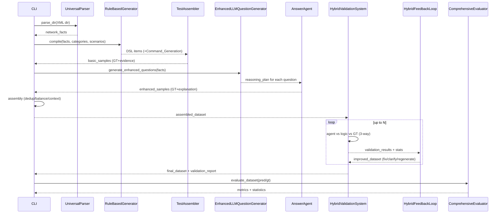

# GIA‑Re: 하이브리드 네트워크 구성 Q&A 데이터셋 파이프라인

네트워크 장비 XML 설정을 표준화된 facts로 파싱하고, 규칙 기반(기초) + LLM 기반(심화) 질문을 생성한 뒤, 에이전트 추론과 로직 계산을 결합한 하이브리드 검증 루프를 통해 자동 교정·평가까지 수행하는 E2E 파이프라인입니다.

- 코드 엔트리포인트: `src/main.py`, `src/integrated_pipeline.py`
- 핵심 단계: Parsing → Basic Gen → Enhanced Gen → Assembly → Hybrid Validation Loop → Evaluation
- 데이터 산출물: `output/` 이하 중간 산출물과 최종 `train/validation/test` 분할 JSON


## 파이프라인 개요

```mermaid
flowchart TD
  subgraph Ingest[1) Parsing]
    A1[(XML Configs\n(data/raw/XML_Data))] -->|UniversalParser| A2[network_facts]
    A3[policies.json] -.-> A2
  end

  subgraph Gen1[2) Basic Generation]
    B1[RuleBasedGenerator\n+ TestAssembler] -->|assemble + compute GT| B2[basic_samples]
    A2 --> B1
  end

  subgraph Gen2[3) Enhanced Generation]
    C1[EnhancedLLMQuestionGenerator] -->|reasoning_plan| C2[AnswerAgent]
    C2 -->|BuilderCore metrics| C3[enhanced_samples]
    A2 --> C1
  end

  subgraph Merge[4) Assembly]
    D1[Dedup + Balance\n+ Context enrichment] --> D2[assembled_dataset]
    B2 --> D1
    C3 --> D1
  end

  subgraph Val[5) Hybrid Validation Loop]
    E1[HybridValidationSystem\n(Agent vs Logic vs GT)] --> E2[3-way compare + stats]
    E2 --> E3[HybridFeedbackLoop\n(fix GT, clarify, regenerate)]
    E3 -->|iterate ≤ N| E1
  end

  subgraph Eval[6) Evaluation]
    F1[ComprehensiveEvaluator\n(EM, F1, BLEU, ROUGE, struct)] --> F2[metrics + report]
  end

  A2 --> B1
  A2 --> C1
  D2 --> E1
  E3 --> F1
  F2 --> G[(Final Outputs\ntrain/validation/test + metadata)]
```

보다 시각적인 HTML 버전은 `docs/pipeline_hybrid.html`에서 확인할 수 있습니다.


## 단계별 I/O · 동작 상세

아래 표는 각 단계의 입력, 핵심 동작, 출력, 관련 모듈(파일 경로)을 정리한 것입니다.

1) Parsing
- 입력: `data/raw/XML_Data/*.xml`, `policies.json`
- 동작: 벤더 중립 표준 facts 생성
- 출력: `network_facts`(메모리), 중간산출물 `output/parsed_facts.json`
- 모듈: `src/parsers/universal_parser.py`, `src/parsers/vendor/xr_facts_parser.py`

2) Basic Generation (rule-based + assembly)
- 입력: `network_facts`, 정책 카테고리
- 동작: DSL 생성 → `TestAssembler`로 정답(ground_truth) 계산, 증거 힌트/소스파일 부여, Command_Generation 포함
- 출력: `basic_dataset.json`
- 모듈: `src/generators/rule_based_generator.py`, `src/assemblers/test_assembler.py`, `src/utils/builder_core.py`

3) Enhanced Generation (LLM + Reasoning)
- 입력: `network_facts`
- 동작: 템플릿 기반 고복잡도 질문, reasoning_plan 생성 → `AnswerAgent`가 BuilderCore 메트릭을 실행하여 GT/해설 합성
- 출력: `enhanced_dataset.json`
- 모듈: `src/generators/enhanced_llm_generator.py`, `src/agents/answer_agent.py`, `src/utils/builder_core.py`, `src/utils/llm_adapter.py`

4) Assembly
- 입력: basic + enhanced 샘플
- 동작: 중복 제거, 카테고리 균형화, 컨텍스트 보강, 복잡도 그룹화 및 저장
- 출력: `assembled_*.json`, 통합 샘플 리스트
- 모듈: `src/integrated_pipeline.py` (assemble 로직)

5) Hybrid Validation Loop
- 입력: 통합 데이터셋, `network_facts`
- 동작: 에이전트(여러 레벨) 추론값 vs BuilderCore 계산값 vs GT 3중 비교 → 오류 분류 → 피드백 루프로 GT 수정/질문 명확화/재생성 → 수렴까지 반복
- 출력: 반복별 통계 `validation_history`, 개선 데이터셋, 최종 `validation_report`
- 모듈: `src/agents/hybrid_validation_system.py`, `src/agents/hybrid_feedback_loop.py`

6) Evaluation
- 입력: 최종 데이터셋
- 동작: EM/F1(Short), BLEU/ROUGE/BERT‑Score(옵션, Long), 구조적 정확도(리스트/JSON)
- 출력: `evaluation_results`, `dataset_statistics`, 최종 `metadata.json`, `train/validation/test.json`
- 모듈: `src/inspectors/evaluation_system.py`


## 실행 방법

사전 준비
- Python 패키지: `pip install -r requirements.txt`
- OpenAI API 키: `.env` 또는 환경변수에 `OPENAI_API_KEY` 설정
- 설정: `config.yaml` 및 `.env`를 통해 모델/토큰/옵션 조정 (`src/utils/config_manager.py`)

통합 파이프라인 (생성 → 하이브리드 검증 → 평가)
- 기본값으로 전체 실행
  - `python src/main.py --xml-dir data/raw/XML_Data --policies policies.json --output-dir output/network_qa --validation-mode hybrid --max-validation-iter 3 --save-intermediate`

개별 하이브리드 검증만 실행
- 기존 데이터셋과 XML을 입력
  - `python src/run_hybrid_validation.py --dataset output/network_qa/basic_dataset.json --xml-dir data/raw/XML_Data --output output/hybrid_validation --mode hybrid --max-iter 3`


## 데이터셋 스키마

샘플 단위 구조: `DatasetSample`
- 필드: `id`, `question`, `context`, `ground_truth`, `explanation`, `answer_type`("short"|"long"), `category`, `complexity`, `level`, `persona?`, `scenario?`, `source_files?`, `metadata?`
- 예시 파일: `output/network_qa/basic_dataset.json`

최종 산출 형식 (예)
- `network_config_qa_dataset.json`
  - `metadata`: 생성 설정, 단계별 통계, 분포
  - `train` / `validation` / `test`: 샘플 리스트
  - `evaluation_results`: 각 샘플/배치 평가 결과


## 평가 메트릭 개요

- Short: Exact‑Match, F1, Token Accuracy
- Long: BLEU, ROUGE‑L, (옵션) BERT‑Score
- 구조적: JSON/리스트 비교 정확도
- 구현: `src/inspectors/evaluation_system.py`


## 구성요소와 역할 매핑

- Parsing: `src/parsers/universal_parser.py`
- Rule‑based Gen: `src/generators/rule_based_generator.py`
- Enhanced Gen + Review: `src/generators/enhanced_llm_generator.py`
- Answer synthesis: `src/agents/answer_agent.py`
- Command generation: `src/agents/command_agent.py`
- Assembly: `src/assemblers/test_assembler.py`
- Hybrid validation: `src/agents/hybrid_validation_system.py`
- Hybrid feedback: `src/agents/hybrid_feedback_loop.py`
- Evaluation: `src/inspectors/evaluation_system.py`
- Core metrics engine: `src/utils/builder_core.py`
- LLM adapter/config: `src/utils/llm_adapter.py`, `src/utils/config_manager.py`


## Mermaid: 상세 시퀀스




## 재현성 및 권장 설정

- 분할 시드 고정: `src/integrated_pipeline.py` 내 `_split_dataset()`에서 `random.seed(42)`
- 모델·토큰 한도: `config.yaml`과 `.env`에서 관리 (`src/utils/config_manager.py`)
- 네트워크 없는 환경: README의 Mermaid 블록은 텍스트, HTML 다이어그램은 `docs/pipeline_hybrid.html`(오프라인 렌더링) 참조. 온라인 Mermaid 렌더가 필요하면 `mermaid.live`에 블록을 붙여넣어 확인


## 인용 안내 (예시)

본 리포지터리를 인용할 경우 다음과 같이 표기해 주세요.

> Y. Kim, “GIA‑Re: Hybrid pipeline for network configuration QA dataset generation and validation,” 2025. GitHub Repository.


## 부록: 주요 파일 경로

- 파이프라인: `src/integrated_pipeline.py`, `src/main.py`
- 검증 루프: `src/agents/hybrid_validation_system.py`, `src/agents/hybrid_feedback_loop.py`
- 생성기: `src/generators/rule_based_generator.py`, `src/generators/enhanced_llm_generator.py`
- 어셈블러: `src/assemblers/test_assembler.py`
- 평가: `src/inspectors/evaluation_system.py`
- 코어: `src/utils/builder_core.py`, `src/utils/llm_adapter.py`, `src/utils/config_manager.py`

