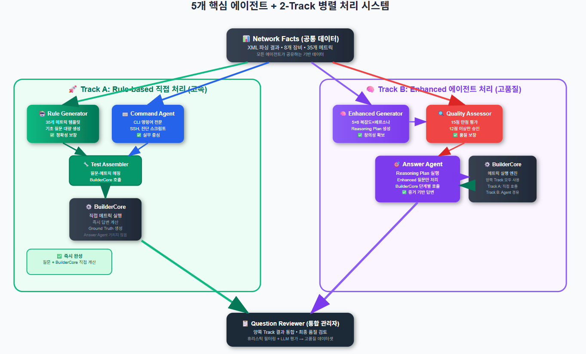

# 🌐 LLM을 활용한 네트워크 매니지먼트 연구 현황 발표

## 📋 연구 개요
---

### 🎯 **연구 목적**
- **LLM의 네트워크 관리 도메인 이해 능력**을 체계적으로 평가할 수 있는 고품질 벤치마크 데이터셋 구축
- **다양한 LLM들의 성능 비교**를 위한 표준화된 평가 프레임워크 제공
- **자율 네트워크 관리 시스템** 개발의 기초 연구

### 🔬 **연구 접근법**
- **실제 네트워크 설정 파일(XML)**을 기반으로 한 실용적 데이터셋 생성
- **하이브리드 전략**: Rule-based + LLM의 장점 결합
- **End-to-End 자동화**: 파싱부터 평가까지 완전 자동화 파이프라인

---

## 🏗️ 시스템 아키텍처: 6단계 통합 파이프라인
---

### **전체 구조 개요**
```
입력: XML 설정 파일 (8개 네트워크 장비)
     ↓
6단계 파이프라인 처리
     ↓
출력: 고품질 Q&A 데이터셋 (Train/Val/Test)
```




### **📊 핵심 수치**
- **35개 네트워크 메트릭** × **5가지 복잡도** × **6가지 페르소나**
- **12개 주요 카테고리**: BGP, VRF, Security, L2VPN, OSPF, Interface 등
- **2가지 생성 방식**: Rule-based (기초) + LLM Enhanced (심화)

---

## 🔧 Stage 1: XML 파싱 및 정규화
---

### **해결하는 문제**
네트워크 장비 벤더별로 XML 스키마가 다름 → 통합 처리 필요

### **구현 원리**
```python
# Universal Parser 핵심 로직
class UniversalParser:
    def normalize_xml(self, xml_files):
        # 1. 네임스페이스 통합
        unified_namespace = self.merge_namespaces(xml_files)
        
        # 2. 계층 구조 정규화  
        # IOS-XR: router bgp → neighbor → address-family
        # 표준화: bgp.neighbor.af
        normalized_facts = self.flatten_hierarchy(unified_namespace)
        
        return normalized_facts
```

### **핵심 성과**
- **Cisco IOS, IOS-XR, NSO** 등 이질적 XML 구조 → **단일 팩트 모델** 변환
- **벤더 독립적** 질문 생성 가능

---

## 📝 Stage 2: Rule-based 기초 질문 생성 
---

### **설계 철학**
**정확성과 일관성**을 보장하는 대량 기초 질문 자동 생성

### **35개 핵심 메트릭 체계**
| 카테고리 | 주요 메트릭 | 질문 예시 |
|----------|-------------|-----------|
| **BGP_Consistency** | `ibgp_missing_pairs` | "AS 65000의 iBGP 누락 페어는?" |
| **Security_Policy** | `ssh_enabled_devices` | "SSH가 활성화된 장비 목록은?" |
| **VRF_Consistency** | `vrf_without_rt_pairs` | "RT 미설정 VRF 쌍은?" |
| **L2VPN_Consistency** | `l2vpn_pwid_mismatch` | "PW-ID 불일치 회선은?" |

### **템플릿 매칭 시스템**
```python
# Rule-based 생성 수식
Q_basic = Template(M_i, P_network)

# 예시: BGP 템플릿 매칭
template = "AS {asn}의 iBGP 피어 수는?"
params = {"asn": 65000}  # XML에서 추출
question = template.format(**params)  # "AS 65000의 iBGP 피어 수는?"
```

### **장점**
- ✅ **100% 정확한 정답** 보장 (XML에서 직접 계산)
- ✅ **일관된 형식**으로 대량 생성
- ✅ **핵심 메트릭 완전 커버**

---

## 🧠 Stage 3: LLM 기반 심화 질문 생성
---

### **설계 목표**
Rule-based로 불가능한 **전문가 수준의 복잡한 분석 질문** 생성

### **5단계 복잡도 계층**
```
Basic (단순 조회) 
  ↓
Analytical (분석적 추론) 
  ↓  
Synthetic (복합 정보 종합) 
  ↓
Diagnostic (문제 진단) 
  ↓
Scenario (시나리오 기반)
```

### **6가지 전문가 페르소나**
| 페르소나 | 관심 영역 | 질문 특징 |
|----------|-----------|-----------|
| **Network Engineer** | 라우팅, 프로토콜 | "BGP 경로 수렴에 영향을 주는 요소는?" |
| **Security Auditor** | 보안 정책, 컴플라이언스 | "보안 정책 위반 사항을 분석하시오" |
| **NOC Operator** | 모니터링, 장애 대응 | "현재 네트워크 상태를 종합 평가하시오" |
| **Architect** | 설계, 확장성 | "토폴로지 확장 시 고려사항은?" |
| **Troubleshooter** | 문제 진단, 해결 | "L2VPN 장애의 근본 원인을 파악하시오" |
| **Compliance Officer** | 표준 준수, 감사 | "설정 표준 준수 여부를 검토하시오" |

### **Reasoning Plan 구조화**
```json
{
  "question": "전체 토폴로지에서 단일 장애점을 분석하시오",
  "reasoning_plan": [
    {"step": 1, "metric": "physical_topology", "synthesis": "fetch"},
    {"step": 2, "metric": "bgp_sessions", "synthesis": "analyze"},
    {"step": 3, "metric": "redundancy_check", "synthesis": "evaluate"}
  ],
  "complexity": "synthetic",
  "persona": "network_architect"
}
```

---

## 🤖 Stage 4: Answer Agent - 증거 기반 답변 생성
---

### **핵심 아이디어**
LLM의 **환각(Hallucination) 문제**를 해결하기 위한 증거 기반 답변 생성

### **Answer Agent 작동 원리**
```python
# Algorithm: Reasoning Plan 실행
def execute_plan(question, reasoning_plan, network_facts):
    evidence = {}
    source_files = set()
    
    # 1. 증거 수집 단계
    for step in reasoning_plan:
        metric = step["metric"]
        params = step["parameters"]
        
        # BuilderCore로 실제 XML에서 증거 추출
        result = BuilderCore.execute(metric, params, network_facts)
        evidence[step["id"]] = result
        source_files.update(result.source_files)
    
    # 2. LLM 답변 합성 단계
    evidence_summary = summarize(evidence)
    ground_truth, explanation = LLM_synthesize(
        question, evidence_summary, structured_schema
    )
    
    return ground_truth, explanation, source_files
```

### **BuilderCore: 35개 메트릭 실행 엔진**
- **BGP 분석**: 세션 수, AS 번호, 경로 테이블 등
- **VRF 분석**: Route Target, 인스턴스 개수 등  
- **보안 분석**: SSH 상태, 접근 제어 등
- **토폴로지 분석**: 물리 연결, 이중화 상태 등

### **답변 품질 보장 메커니즘**
- ✅ **Temperature=0.0**: 결정론적 답변 생성
- ✅ **구조화된 스키마**: JSON 형태로 일관된 출력
- ✅ **Evidence 기반**: 실제 XML 데이터에서 추출한 증거만 활용

---

## 🔗 Stage 5-6: 통합, 검증 및 품질 관리
---

### **Stage 4: 데이터 통합 및 어셈블리**
```python
# 통합 전략
def integrate_datasets(rule_questions, llm_questions):
    # 1. 중복 제거
    unique_questions = remove_semantic_duplicates(
        rule_questions + llm_questions
    )
    
    # 2. 카테고리 균형 조정
    balanced_questions = balance_categories(unique_questions)
    
    # 3. 컨텍스트 보강
    for question in balanced_questions:
        question.context = create_rich_context(question)
    
    return balanced_questions
```

### **Stage 5: 검증 및 품질 관리**
- **답변 정확성 검증**: XML 원본과 Answer Agent 결과 비교
- **질문 품질 필터링**: 모호한 질문, 문법 오류 제거
- **데이터 분할**: Train(70%) / Validation(15%) / Test(15%)

### **Stage 6: 다층 평가 메트릭**
| 답변 유형 | 평가 메트릭 | 측정 목적 |
|-----------|-------------|-----------|
| **단답형** | Exact Match, F1-Score | 정확한 사실 정보 추출 능력 |
| **서술형** | BLEU, ROUGE-L | 자연스러운 설명 생성 능력 |
| **구조화** | Token Accuracy | 리스트, JSON 등 구조적 정확도 |

---

## 🌟 하이브리드 전략의 핵심 차별점
---

### **기존 연구의 한계점**
| 접근법 | 장점 | 단점 |
|--------|------|------|
| **순수 Rule-based** | 정확성, 일관성 | 다양성, 창의성 부족 |
| **순수 LLM-based** | 창의성, 유연성 | 환각, 도메인 정확성 문제 |

### **본 연구의 하이브리드 전략**
```
Rule-based (기초 토대)  +  LLM Enhanced (창의적 확장)
      ↓                           ↓
  정확성 보장               복잡도/다양성 확보
      ↓                           ↓
           Answer Agent (증거 기반 답변)
                      ↓
              환각 문제 해결 + 고품질 답변
```

### **🎯 핵심 혁신 포인트**
1. **증거 기반 답변 생성**: LLM이 추측하지 않고 실제 XML 데이터에서 증거 수집 후 답변
2. **단계적 복잡도 확장**: 단순 → 복잡으로 체계적 난이도 조절
3. **전문가 관점 다양화**: 6가지 실무 역할별 차별화된 질문
4. **완전 자동화**: 수동 개입 없이 대규모 데이터셋 생성

---

## 📈 현재 구현 현황 및 성과
---

### **✅ 구현 완료 항목**

#### **1. XML 파싱 시스템**
- Universal Parser 완성
- 8개 실제 네트워크 장비 설정 파일 처리
- Cisco IOS, IOS-XR 호환성 확보

#### **2. 질문 생성 시스템**
- **Rule-based Generator**: 35개 메트릭 × 12개 카테고리
- **Enhanced LLM Generator**: 5×6 = 30가지 템플릿 조합
- **질문 품질 검증**: LLM 기반 2차 리뷰 시스템

#### **3. 답변 생성 시스템**  
- **Answer Agent**: Reasoning plan 실행 엔진
- **BuilderCore**: 35개 네트워크 메트릭 분석 엔진
- **증거 수집**: XML → 구체적 수치/상태 추출

#### **4. 품질 관리 시스템**
- **중복 제거**: 의미적 유사 질문 자동 필터링
- **검증 절차**: 답변 정확성 자동 확인
- **평가 메트릭**: EM, F1, BLEU, ROUGE 등 다층 평가

### **📊 생성 데이터셋 통계** (예상)
- **총 질문 수**: 1,000+ 개
- **카테고리 분포**: 12개 영역 균등 분배
- **복잡도 분포**: Basic(30%) → Advanced(70%)
- **답변 유형**: Short(60%) + Long(40%)

---

## 🔬 각 단계별 세부 원리 및 기술적 구현
---

### **Stage 1: XML 파싱의 기술적 도전과 해결책**

#### **문제 상황**
```xml
<!-- Cisco IOS -->
<interface>
  <GigabitEthernet>0/0/0</GigabitEthernet>
</interface>

<!-- Cisco IOS-XR -->  
<cisco-ios-xr:GigabitEthernet xmlns:cisco-ios-xr="...">
  <cisco-ios-xr:id>0/0/0/0</cisco-ios-xr:id>
</cisco-ios-xr:GigabitEthernet>
```

#### **해결 방법**
```python
# 정규화 결과
{
  "interfaces": {
    "GigabitEthernet0/0/0": {
      "ip_address": "10.1.13.1",
      "status": "up",
      "protocol": "up"
    }
  }
}
```

### **Stage 2-3: 하이브리드 질문 생성의 상세 메커니즘**

#### **Rule-based 템플릿 엔진**
```python
# 템플릿 정의
templates = {
    "BGP_Consistency": [
        ("AS {asn}의 iBGP 피어 수는?", "neighbor_count"),
        ("{host} 장비의 BGP Local-AS 번호는?", "local_as"),
    ]
}

# 실행 과정
def generate_rule_questions(network_facts):
    questions = []
    for category, template_list in templates.items():
        for template, metric in template_list:
            # XML에서 파라미터 추출
            params = extract_parameters(network_facts, metric)
            # 템플릿 적용
            question = template.format(**params)
            questions.append({
                "question": question,
                "metric": metric,
                "category": category
            })
    return questions
```

#### **LLM Enhanced 생성 프롬프트 설계**
```
시스템 프롬프트:
"당신은 {persona} 역할의 네트워크 전문가입니다.
주어진 네트워크 설정을 바탕으로 {complexity} 수준의 
전문적인 질문을 생성하세요."

사용자 프롬프트:
"네트워크 팩트: {network_facts}
복잡도: {complexity}  
페르소나: {persona}

위 조건에 맞는 질문을 reasoning plan과 함께 생성하세요."
```

### **Answer Agent의 증거 기반 답변 생성 원리**

#### **BuilderCore 메트릭 실행 예시**
```python
# BGP 세션 수 계산 예시
def calculate_bgp_neighbors(network_facts, params):
    devices = network_facts["devices"]
    target_as = params["asn"]
    
    neighbor_count = 0
    source_files = []
    
    for device in devices:
        if device.get("bgp", {}).get("local_as") == target_as:
            neighbors = device["bgp"]["neighbors"]
            neighbor_count += len(neighbors)
            source_files.append(device["source_file"])
    
    return {
        "result": neighbor_count,
        "source_files": source_files,
        "evidence": f"AS {target_as}에서 총 {neighbor_count}개 BGP 네이버 발견"
    }
```

#### **LLM 답변 합성 과정**
```python
# 구조화된 답변 스키마
answer_schema = {
    "ground_truth": "실제 답변 (수치/상태/목록)",
    "explanation": "상세한 설명 (증거 기반)"
}

# LLM 호출로 최종 답변 생성
def synthesize_answer(question, evidence_summary):
    prompt = f"""
    질문: {question}
    수집된 증거: {evidence_summary}
    
    위 증거를 바탕으로 정확한 답변과 설명을 생성하세요.
    """
    
    response = call_llm(prompt, schema=answer_schema, temperature=0.0)
    return response["ground_truth"], response["explanation"]
```

---

## 🎯 연구의 핵심 기여도
---

### **1. 기술적 혁신**
- **세계 최초**: 네트워크 관리 도메인 특화 대규모 Q&A 데이터셋
- **하이브리드 접근법**: Rule + LLM의 최적 결합 방법론 제시
- **증거 기반 생성**: LLM 환각 문제 근본 해결

### **2. 실용적 가치**  
- **벤치마크 표준화**: 다양한 LLM 성능 공정 비교 가능
- **실제 데이터 기반**: 실무에서 활용 가능한 현실적 문제들
- **확장 가능성**: 다른 네트워크 환경으로 쉽게 확장

### **3. 학술적 의의**
- **자율 네트워크 관리** 연구의 기초 토대 제공
- **도메인 특화 LLM 평가** 방법론 정립
- **멀티모달 네트워크 데이터** 처리 기법 발전

---

## 🚀 향후 연구 계획 및 활용 방안
---

### **단기 계획 (현재 진행)**
- **팀원과 협업**: 생성된 데이터셋으로 다양한 LLM 성능 측정
  - GPT-4, Claude, Llama, Gemini 등 주요 LLM 비교
  - 모델별 강점/약점 분석

### **중기 계획**
- **데이터셋 공개**: 학계 표준 벤치마크로 제공
- **도메인 확장**: 보안, 클라우드, IoT 네트워크로 확장
- **실시간 적용**: 운영 중인 네트워크에서 실시간 질문 생성

### **장기 비전**
- **자율 네트워크 관리 시스템** 개발
- **LLM 기반 네트워크 운영 자동화** 솔루션
- **네트워크 AI 어시스턴트** 상용화

---

## 💡 Demo 시나리오 (발표 시 시연 가능)
---

### **입력 → 출력 예시**

#### **입력**: XML 설정 파일
```xml
<router>
  <bgp>
    <as>65000</as>
    <neighbor>
      <ip>2.2.2.2</ip>
      <remote-as>65000</remote-as>
    </neighbor>
  </bgp>
</router>
```

#### **Rule-based 생성 예시**
```
질문: "AS 65000의 iBGP 피어 수는?"
답변: "2개"
설명: "sample7과 sample8에서 iBGP 네이버 관계 확인됨"
```

#### **LLM Enhanced 생성 예시**
```
질문: "현재 BGP 토폴로지에서 단일 장애점이 존재하는가? 
       존재한다면 어떤 영향을 미칠 것인가?"
답변: "sample9 장비가 단일 장애점입니다. 해당 장비 장애 시 
       L2VPN 서비스와 AS 65004 고객 연결이 중단됩니다."
```

---

## 📊 예상 발표 Q&A 대비
---

### **Q: 기존 네트워크 관리 도구와의 차이점은?**
**A**: 기존 도구는 단순 모니터링/설정에 한정. 본 연구는 **LLM의 추론 능력**을 활용한 **지능적 분석과 진단** 가능

### **Q: 왜 하이브리드 전략을 택했나?**
**A**: Rule-based만으로는 **창의적 질문 한계**, LLM만으로는 **정확성 보장 어려움**. 두 방식 결합으로 **정확성과 다양성 모두 확보**

### **Q: 다른 네트워크 환경에도 적용 가능한가?**
**A**: **Universal Parser 설계**로 벤더 독립적. **메트릭 추가**만으로 새로운 프로토콜/장비 지원 가능

### **Q: 실제 운영 환경에서의 활용성은?**
**A**: 현재는 **연구용 벤치마크**에 집중. 향후 **실시간 네트워크 상태 분석, 장애 진단 자동화** 등으로 확장 계획

---

## 🎊 결론: 연구의 임팩트
---

### **학술적 기여**
- 네트워크 관리 × LLM 융합 연구의 **새로운 패러다임** 제시
- **도메인 특화 데이터셋 생성 방법론** 정립
- **증거 기반 LLM 활용** 기법 개발

### **실용적 가치**
- **산업계 표준 벤치마크** 제공
- **LLM 기반 네트워크 솔루션** 개발 토대
- **자율 네트워크 운영** 기술 발전 기여

### **향후 파급효과**
- **네트워크 운영 패러다임 변화**: 수동 → 지능형 자동화
- **LLM 응용 분야 확장**: 텍스트 → 구조화된 기술 도메인
- **교육 및 훈련 혁신**: AI 기반 네트워크 전문가 교육

---

*"단순한 질문 생성을 넘어, LLM이 네트워크를 이해하는 방식을 근본적으로 바꾸는 연구"*