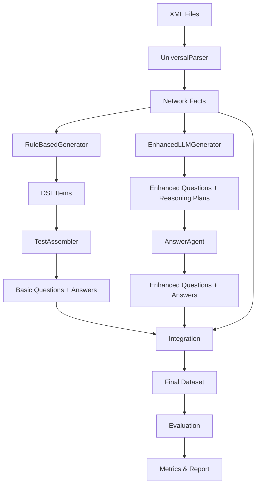

네트워크 데이터셋 생성 파이프라인의 각 구성요소들이 어떻게 동작하는지 자세히 설명해드리겠습니다!
Read file: /workspace/Yujin/GIA/Make_Dataset/src/main.py
Ran tool
Ran tool
Ran tool

Read file: /workspace/Yujin/GIA/Make_Dataset/src/parsers/universal_parser.py
Read file: /workspace/Yujin/GIA/Make_Dataset/src/utils/builder_core.py
Read file: /workspace/Yujin/GIA/Make_Dataset/src/assemblers/test_assembler.py

Ran tool
Read file: /workspace/Yujin/GIA/Make_Dataset/src/generators/rule_based_generator.py
Read file: /workspace/Yujin/GIA/Make_Dataset/src/generators/enhanced_llm_generator.py
Ran tool

## 🔧 **네트워크 데이터셋 생성 파이프라인 - 각 구성요소 상세 분석**

데이터셋 생성 파이프라인의 각 구성요소들이 어떻게 동작하는지 상세히 설명드리겠습니다!

---

## 📄 **1. XML Parser (UniversalParser)**

### **역할**
- **입력**: XML 네트워크 설정 파일들 (디렉터리)
- **출력**: 구조화된 Network Facts (JSON 형태)

### **동작 방식**
```python
def parse_dir(self, xml_dir: str) -> Dict[str, Any]:
    # XML 파일들을 순서대로 읽어서
    xmls = sorted([p for p in Path(xml_dir).iterdir() if p.suffix.lower() == ".xml"])
    # XR 파서로 통일 처리하여 구조화된 데이터로 변환
    return xr_facts_parser.parse_files(xmls)
```

### **출력 구조 (Network Facts)**
```json
{
  "devices": [
    {
      "system": {"hostname": "CE1"},
      "interfaces": [{"name": "GigE0/0/0", "ipv4": "192.168.1.1/24"}],
      "routing": {
        "bgp": {"local_as": 65001, "neighbors": [...]}
      },
      "security": {"ssh": {"present": true}},
      "services": {"vrf": [...]}
    }
  ]
}
```

---

## ⚙️ **2. BuilderCore (핵심 연산 엔진)**

### **역할**
- Network Facts를 받아서 **메트릭 계산** 수행
- 질문에 대한 **정확한 답변** 생성
- **DSL 패턴 확장** 및 **템플릿 처리**

### **핵심 메소드**
```python
def calculate_metric(self, metric: str, params: Dict = None) -> Tuple[Any, List[str]]:
    """특정 메트릭을 계산하고 결과와 참조 파일들을 반환"""
    # 예: "ssh_missing_count" → SSH 미설정 장비 수 계산
    # 예: "ibgp_missing_pairs" → iBGP 누락 피어 쌍 찾기
```

### **지원 메트릭 예시**
- **BGP**: `ibgp_fullmesh_ok`, `bgp_neighbor_count`
- **VRF**: `vrf_without_rt_count`, `vrf_names_set` 
- **Security**: `ssh_missing_devices`, `aaa_enabled_devices`
- **Interface**: `interface_count`, `interface_ip_map`

---

## 📋 **3. Rule-based Generator**

### **역할**
- **정책 파일(policies.json)** 기반으로 기초 질문 생성
- **템플릿 패턴**을 사용해 체계적인 질문 생성
- **다중 시나리오** 지원 (normal, failure, expansion)

### **동작 과정**
```python
def compile(self, capabilities, categories, scenario_type="normal"):
    # 1. policies.json 로드
    # 2. 카테고리별로 적용 가능한 정책 필터링
    # 3. 템플릿 패턴으로 질문 생성
    # 4. DSL 구조로 변환
```

### **질문 패턴 예시**
```python
# 템플릿
"AS {asn}의 iBGP Full-Mesh 구성은 완벽합니까?"

# 실제 생성된 질문
"AS 65001의 iBGP Full-Mesh 구성은 완벽합니까?"
```

---

## 🧠 **4. Enhanced LLM Generator**

### **역할**
- **LLM 기반**으로 고도화된 복합 추론 질문 생성
- **5단계 복잡도** × **6가지 페르소나** 조합
- **추론 계획(reasoning plan)** 포함한 구조화된 질문

### **복잡도 단계**
- **Basic**: 단순 조회 (`"BGP 세션 수는?"`)
- **Analytical**: 관계 분석 (`"VRF별 RT 설정 일관성은?"`)
- **Synthetic**: 토폴로지 파악 (`"MPLS L3VPN 서비스 구조는?"`)
- **Diagnostic**: 불일치 탐지 (`"L2VPN PW-ID 불일치는?"`)
- **Scenario**: 상황 분석 (`"단일 장애점은?"`)

### **페르소나별 관점**
- **Network Engineer**: 기술적 구현 중심
- **Security Auditor**: 보안 정책 준수 중심
- **NOC Operator**: 운영/모니터링 중심
- **Troubleshooter**: 문제 해결 중심

### **출력 구조**
```json
{
  "question": "AS 65001의 iBGP 풀메시 누락이 경로 수렴에 미치는 영향은?",
  "reasoning_plan": [
    {"step": 1, "required_metric": "ibgp_missing_pairs", "metric_params": {"asn": 65001}},
    {"step": 2, "required_metric": "ibgp_fullmesh_ok", "metric_params": {"asn": 65001}}
  ],
  "complexity": "analytical",
  "persona": "network_engineer"
}
```

---

## 🤖 **5. Answer Agent**

### **역할**
- **Enhanced LLM 질문**에 대한 정답 및 해설 생성
- **추론 계획(reasoning plan)** 단계별 실행
- **BuilderCore**와 연동하여 정확한 증거 수집

### **동작 과정**
```python
def execute_plan(self, question: str, plan: List[Dict], answer_type: str):
    # 1. 추론 계획의 각 단계별로 메트릭 실행
    for step in plan:
        metric = step.get("required_metric")
        result, files = self.builder.calculate_metric(metric, step.get("params"))
        self.evidence[f"step_{step.get('step')}_{metric}"] = result
    
    # 2. 수집된 증거를 바탕으로 LLM이 정답과 해설 생성
    return self._synthesize_json_answer(question, plan, answer_type)
```

### **출력 예시**
```json
{
  "ground_truth": 2,
  "explanation": "AS 65001에서 iBGP 누락 쌍은 CE1-CE2, CE1-CE3 총 2개입니다. 이는 풀메시 구성이 완성되지 않았음을 의미합니다.",
  "source_files": ["CE1.xml", "CE2.xml", "CE3.xml"]
}
```

---

## 🔧 **6. Test Assembler**

### **역할**
- **Rule-based Generator**에서 생성된 DSL을 받아서
- **BuilderCore**로 실제 답변 계산
- **질문-답변 쌍** 완성

### **동작 과정**
```python
def assemble(self, network_facts, dsl_items, scenario_conditions=None):
    # 1. DSL의 각 아이템에 대해
    # 2. BuilderCore로 메트릭 계산 수행
    # 3. 시나리오 조건 적용
    # 4. 최종 테스트 케이스로 변환
```

---

## 📊 **7. Inspectors (평가 시스템)**

### **Evaluation System**
- **EM(Exact Match)**: 정확한 일치 여부
- **F1 Score**: 부분 일치 점수
- **BERT Score**: 의미적 유사도 (선택적)

### **Intent Inspector**  
- 질문의 **의도(intent)** 분석
- **메트릭 추론** 및 **파라미터 추출**

---

## 🔄 **8. 전체 데이터 흐름**



---

## 🎯 **9. 핵심 특징**

### **이중 생성 방식**
- **Rule-based**: 안정적이고 체계적인 기초 질문
- **LLM-based**: 창의적이고 복합적인 심화 질문

### **정확성 보장**
- **BuilderCore**: 모든 답변은 실제 설정 데이터 기반 계산
- **Answer Agent**: LLM이 추론하되, 증거는 BuilderCore에서 수집

### **다면적 평가**
- **복잡도별**: Basic → Scenario 단계별 난이도
- **페르소나별**: 각 역할의 관심사에 맞는 질문
- **시나리오별**: 정상/장애/확장 상황별 대응

이렇게 각 구성요소가 유기적으로 연결되어 **고품질 네트워크 Q&A 데이터셋**을 자동 생성합니다! 🚀